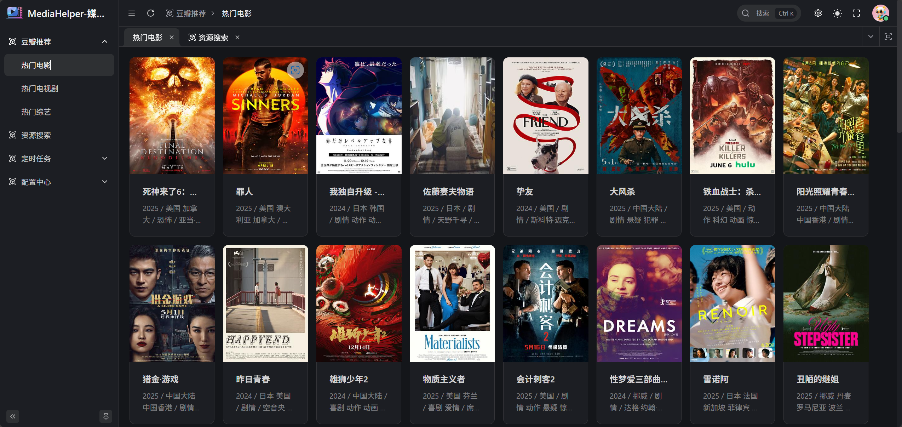
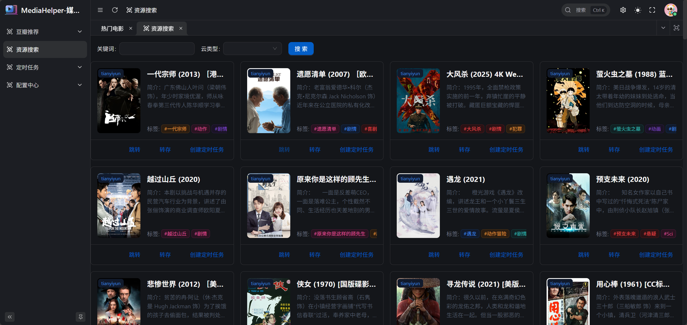
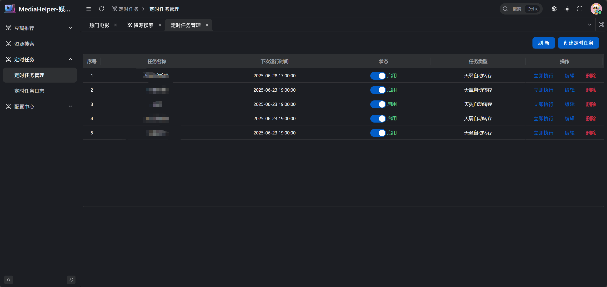

# MediaHelper

<div align="center">
    
    <h1>MediaHelp</h1>
    <p>🎬 一站式媒体资源管理助手</p>
    
[](LICENSE)
[](https://hub.docker.com/r/rongyunmu/mediahelp)
[](https://github.com/JieWSOFT/MediaHelp)
    
</div>

## 📖 简介

MediaHelp 是一个强大的媒体资源管理工具，支持多个主流网盘的资源转存和管理功能。它能帮助你更高效地管理和组织你的媒体资源，是您的私人媒体管理助手。

## ✨ 核心特性

- 🔍 **智能资源搜索**
  - 集成 TG 频道资源搜索
  - 支持动态配置搜索参数
  - 快速定位所需资源
  - 支持豆瓣电影推荐

- 📱 **多网盘支持**
  - 支持夸克网盘
  - 支持天翼云盘
  - 统一管理界面
  - 一键转存功能

- 🔐 **自动化转存**
  - 支持定时任务配置
  - 自动化资源转存
  - 批量处理能力
  - 任务状态监控

- 🎭 **媒体管理** 
  - Emby 飞牛影视集成支持，支持自动刷新
  - 媒体库管理 (开发中)

## 🖥️ 功能展示

<details>
<summary>📺 豆瓣推荐功能</summary>
<div align="center">
    
    <p>基于豆瓣评分的智能影视推荐</p>
</div>
</details>

<details>
<summary>🔍 资源搜索功能</summary>
<div align="center">
    
    <p>强大的资源搜索与管理界面</p>
</div>
</details>

<details>
<summary>⏰ 定时任务管理</summary>
<div align="center">
    
    <p>灵活的定时任务配置系统</p>
</div>
</details>

## 🚀 快速开始

### 系统要求
- Docker 运行环境

### Docker 部署

```bash
docker run -d \
  -p 3300:80 \
  -v /你的配置目录:/app/backend/config \
  --name mediahelper \
  --restart unless-stopped \
  rongyunmu/mediahelp
```

### 配置说明
1. 访问 `http://你的IP:3300`
2. 使用默认账户登录：
   - 用户名：`admin`
   - 密码：`admin`

> ⚠️ 安全提示：强烈建议私有化部署，因为涉及个人网盘信息安全。
> 由于特殊原因，源码停止于此版本， docker镜像会一直更新

## 🔧 常见问题

<details>
<summary>如何修改默认端口？</summary>
修改 Docker 运行命令中的端口映射参数，例如 `-p 8080:80` 将使用 8080 端口访问
</details>

<details>
<summary>如何备份配置？</summary>
所有配置文件都在挂载的配置目录中，定期备份该目录即可
</details>

## 👥 社区交流
<a href="https://t.me/mediahelp_offical">
  社区链接
</a>
<div align="center">
    <p>欢迎加入我们充满活力的社区！在这里，你可以：</p>
    <ul align="left" style="display: inline-block;">
        <li>分享使用经验和技巧</li>
        <li>获取最新项目动态</li>
        <li>寻求技术支持和帮助</li>
        <li>参与功能讨论和建议</li>
    </ul>
    <p>
        <a href="https://t.me/mediahelp_offical">
            
        </a>
    </p>
</div>

## 🤝 支持项目

如果您觉得这个项目对您有帮助，可以通过以下方式支持我们：

1. 给项目一个 ⭐️ Star
2. 提交 Pull Request 贡献代码
3. 扫描下方二维码进行打赏支持

<div align="center">
    
</div>

## 📝 免责声明

- 本项目为个人兴趣开发，旨在提高网盘使用效率
- 项目仅封装现有网盘 API，未进行任何破解行为
- 所有数据均来自网盘官方 API
- 开发者不对网盘内容及 API 变动负责
- 仅供学习与交流使用，未经授权禁止商业使用
- 严禁用于任何非法用途

## 📄 许可证

本项目基于 [MIT 许可证](LICENSE) 开源。

---

<div align="center">
    <p>Made with ❤️ by MediaHelper Team</p>
</div> 